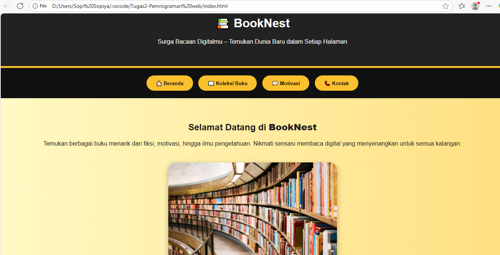
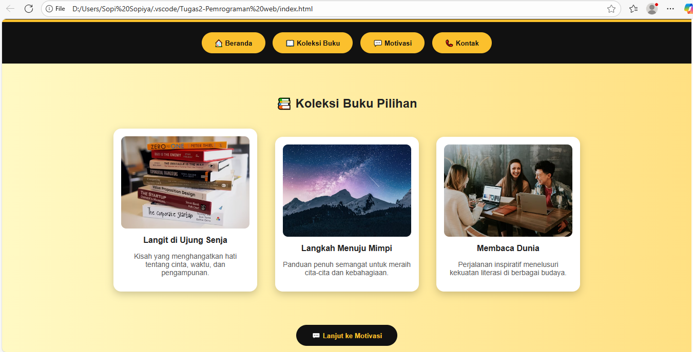
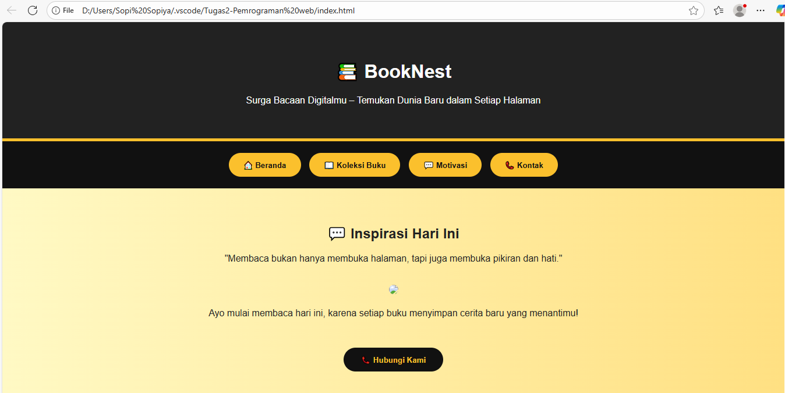
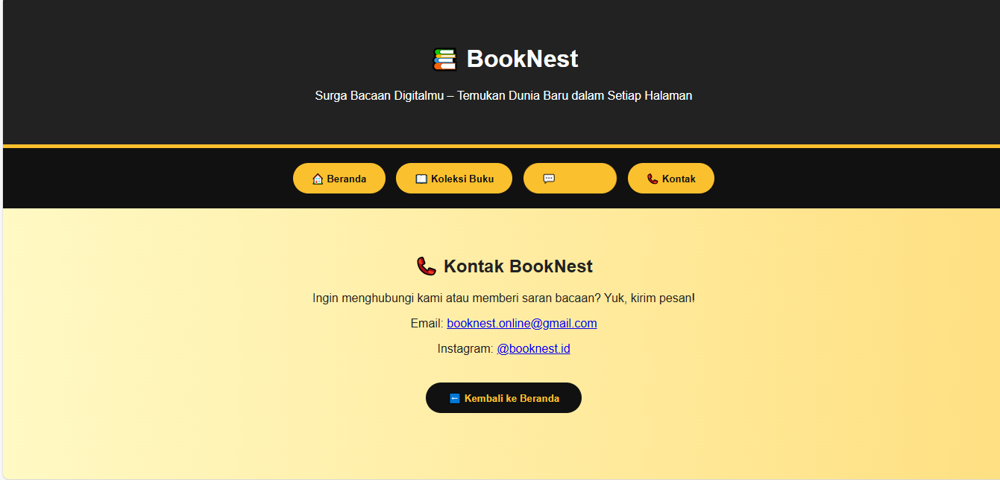

# Tugas E-Learning PemogramanWeb 1
Membuat website sederhana yang dibuat untuk mata kuliah Pemrograman Web1 
  
   ---

# 📚 Website Baca Buku Online

ebsite sederhana Wbertema **Baca Buku Online** yang dibuat untuk memenuhi tugas mata kuliah **Pemrograman Web 1**.  
Website ini memiliki tampilan interaktif dengan beberapa halaman seperti **Beranda, Koleksi Buku, Motivasi Membaca, dan Kontak**.

---

## 👩‍💻 Pembuat

- **Nama:** Arika Azhar  
- **NPM:** 23552011408  
- **Mata Kuliah:** Pemrograman Web 1  

Semua halaman diatur agar tampil **dalam satu file utama (`index.html`)**, dan isi halaman akan berubah ketika pengguna menekan tombol menu seperti:
- **Beranda**
- **Koleksi Buku**
- **Motivasi**
- **Kontak**

---

## 🖼️ Tampilan Website

Berikut hasil tampilan dari masing-masing halaman website:

### 🏠 Beranda

### 📚 Koleksi Buku

### 💡 Motivasi Membaca

### ✉️ Kontak

---
## 👩‍💻 Pembuat

- **Nama:** Arika Azhar  
- **NPM:** 23552011408  
- **Mata Kuliah:** Pemrograman Web 1  

